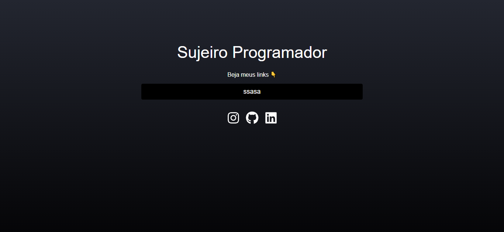

   
  <h1 align="center">Sujeito Programador</h1>

 
# Sobre o projeto
O projeto consiste em inicialmente uma tela onde vão conter todos os links que desejamos adicionar das nossas rede sociais, uma tela de login para apenas administrador, uma tela para podermos criar nossos links e personalizar e outra dela para podermos editar os links

## Layout 

# Tecnologias utilizadas
- React.js
- TailwinCss
- Vite.js
- FireBase

# Autor

## @Duck.Web

<!-- INSTAGRAM -->

